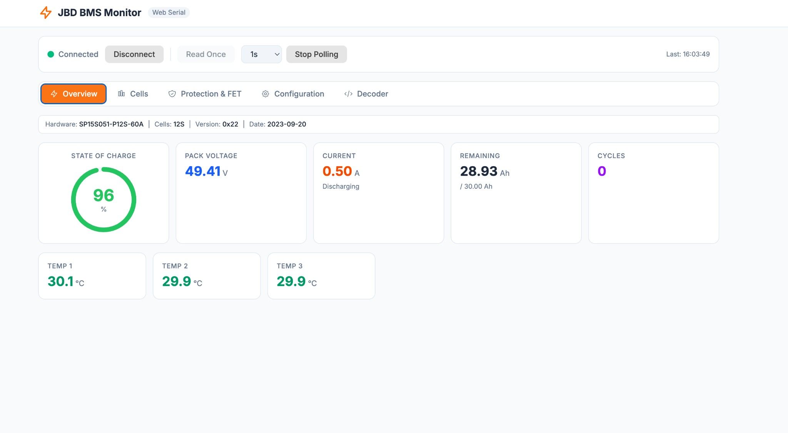
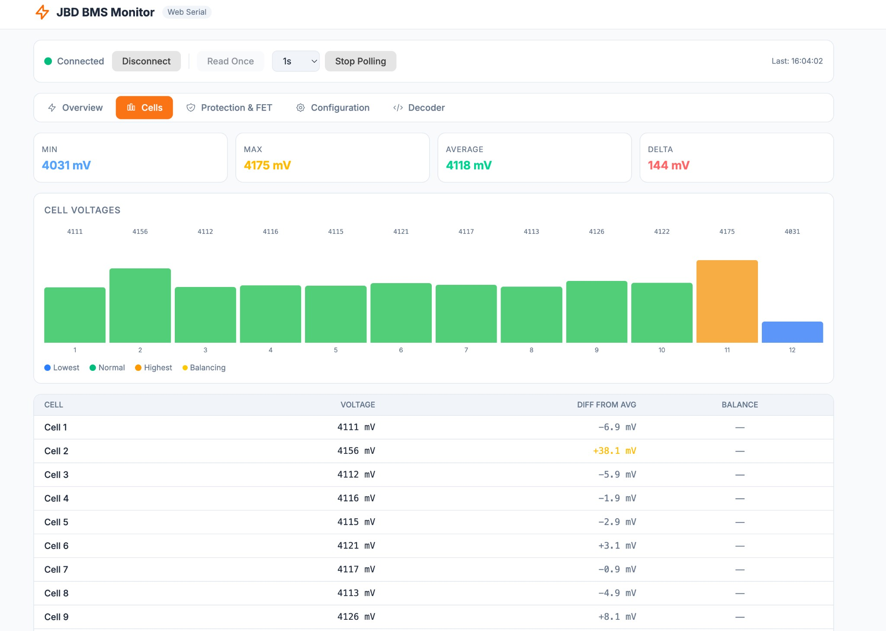
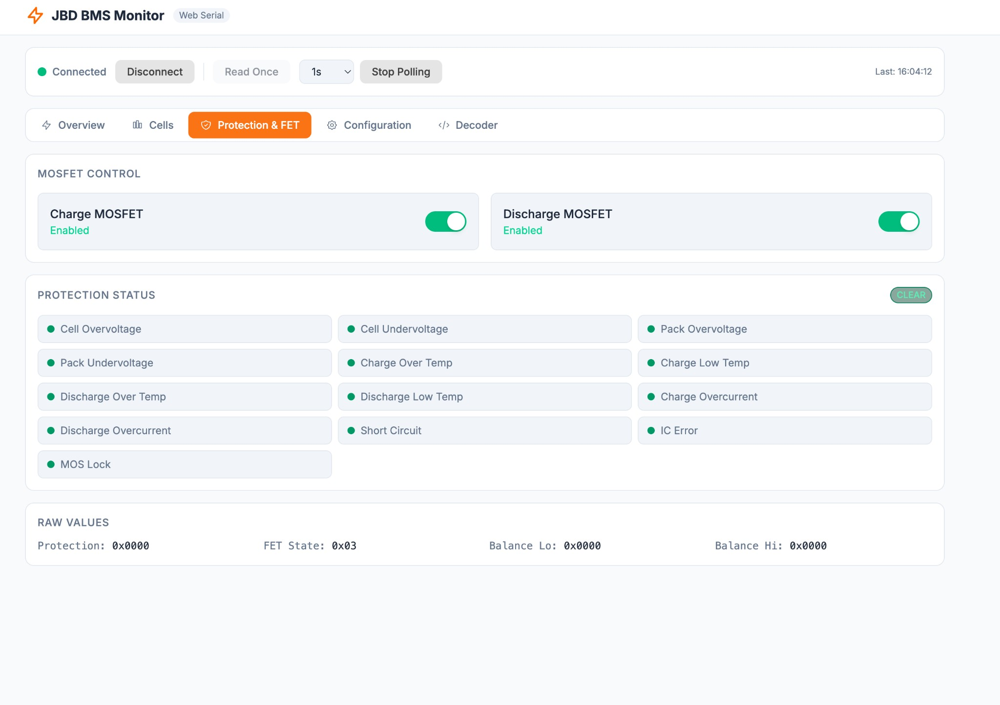
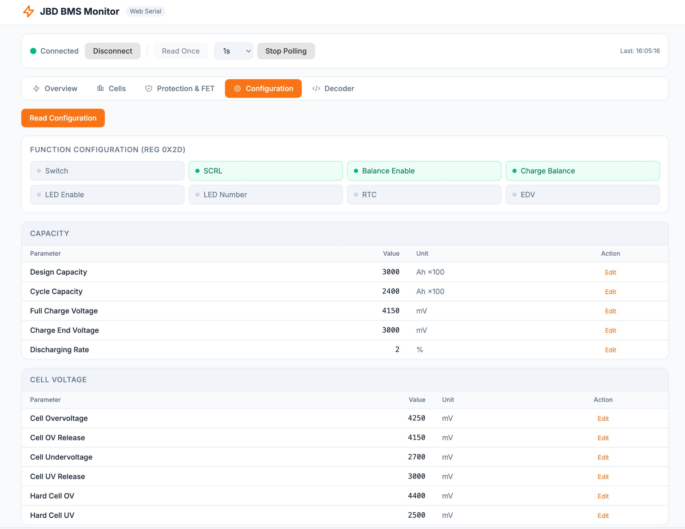
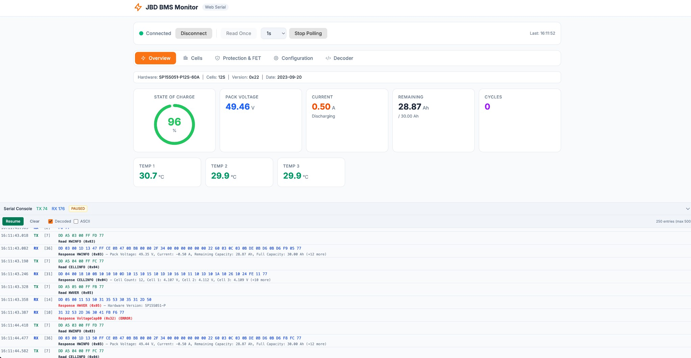

# JBD BMS Monitor

Browser-based dashboard for JBD/Xiaoxiang Battery Management Systems over USB serial. No backend — communicates directly from the browser using the Web Serial API.

**Live site: [bms.hldesign.io](https://bms.hldesign.io)**

## Screenshots

| Overview | Cells |
|----------|-------|
|  |  |

| Protection & FET | Configuration |
|------------------|---------------|
|  |  |

## Requirements

- **Chrome or Edge** (Web Serial API is not supported in Firefox/Safari)
- USB serial adapter connected to the BMS UART port (e.g. FTDI, CH340, CP210x)

## Quick Start

```bash
cd bms-ui
npm install
npm run dev
```

Open **http://localhost:5173** in Chrome.

## Connecting

1. Click **Pick Port...** to open the browser's serial port picker and select your USB serial device.
2. Or click **Autodetect** — if no ports have been granted yet, the picker opens automatically. After selecting, it probes the port by sending a JBD read command and auto-connects if a BMS responds.
3. Default baud rate is **9600** (standard for JBD BMS). Change it in the dropdown if your BMS uses a different rate.

Once connected, click **Read Once** for a single snapshot or **Start Polling** for continuous live data at configurable intervals (0.5s–5s).

## Tabs

| Tab | What it shows |
|-----|---------------|
| **Overview** | Pack voltage, current, SOC gauge, remaining/full capacity, cycle count, temperatures |
| **Cells** | Per-cell voltage bar chart, min/max/avg/delta stats, balance status indicators, detailed table |
| **Protection & FET** | Charge/discharge MOSFET toggle switches, all 13 protection flags (OV, UV, OT, OC, short circuit, etc.) |
| **Configuration** | Full EEPROM read/write — capacity settings, voltage/current/temperature protection limits, balance config, system settings, device info |
| **Decoder** | Manual JBD packet decoder — paste hex bytes and get a full structural breakdown without a live BMS connection |

## Manual Decoder

The **Decoder** tab is a standalone packet analysis tool. It lets you paste raw hex bytes captured from serial traffic (or typed by hand) and decodes them into human-readable JBD protocol fields — no hardware required.

### Supported input formats

| Format | Example |
|--------|---------|
| Space-separated hex | `DD A5 03 00 FF FC 77` |
| Colon-separated hex | `DD:A5:03:00:FF:FC:77` |
| Continuous hex | `DDA50300FFFC77` |
| C-style escaped | `\xDD\xA5\x03\x00\xFF\xFC\x77` |

You can also paste multi-packet streams — the decoder splits on the `DD`…`77` framing automatically.

### What it decodes

- **Packet structure** — start byte, command type (read `0xA5` / write `0x5A`), register, length, data, CRC, end byte
- **Request packets** — shows the register being read or written and the payload
- **Response packets** — validates CRC and status byte, then interprets the data payload based on the register:
  - Hardware info (pack voltage, current, SOC, temperatures, cycle count, protection flags, etc.)
  - Cell info (individual cell voltages)
  - Configuration registers (voltage/current/temperature protection limits, balance settings, timing, etc.)
  - String registers (manufacturer name, device name, barcode)
- **Errors** — highlights CRC mismatches, truncated packets, and unknown registers

### Visual output

Each decoded packet shows:

1. A **colour-coded byte map** — each byte is highlighted by its role in the packet (header, command, register, data, CRC, trailer)
2. A **field table** breaking down the packet structure with byte offsets, raw hex, and decoded values
3. A **decoded data table** with human-readable labels, values, and units

### Quick-start examples

Click the built-in **example buttons** to load sample read-request, hardware-info response, and cell-info response packets for quick exploration.

## Serial Console

Click the **Serial Console** bar at the bottom to expand the raw traffic viewer:

- Every TX (green) and RX (blue) packet is shown as a hex dump with millisecond timestamps
- Toggle **Decoded** to see parsed protocol fields inline, or **ASCII** to see printable characters alongside hex
- **Pause** to freeze the log for inspection (new traffic is discarded while paused)
- **Clear** to reset the log
- Auto-scrolls to follow new data; scroll up manually to pause auto-scroll



## Project Structure

```
src/
├── main.tsx                     # Entry point
├── App.tsx                      # Root component, tab routing
├── index.css                    # Global styles
├── components/
│   ├── ConnectionBar.tsx        # Serial port picker, baud rate, connect/disconnect
│   ├── OverviewPanel.tsx        # Pack-level dashboard
│   ├── CellsPanel.tsx           # Per-cell voltage chart and table
│   ├── ProtectionPanel.tsx      # Protection flags and FET controls
│   ├── ConfigPanel.tsx          # EEPROM configuration read/write
│   ├── DecoderPanel.tsx         # Manual hex packet decoder
│   └── TrafficConsole.tsx       # Raw serial traffic log
├── hooks/
│   ├── useBMS.ts                # BMS connection state and polling logic
│   └── useTrafficLog.ts         # TX/RX traffic capture hook
└── lib/
    ├── jbd-protocol.ts          # Protocol constants, register maps, decoders
    └── serial.ts                # Web Serial API wrapper (open, read, write)
```

## Build for Production

```bash
npm run build
```

Output is in `dist/` — serve with any static file server.

## Protocol

Implements the JBD UART protocol: `DD [CMD] [REG] [LEN] [DATA] [CRC] 77`

- CRC: `uint16`, computed as `0 - sum(REG, LEN, DATA...)`, big-endian
- Read command: `0xA5`, Write command: `0x5A`
- EEPROM must be opened (`0x56 0x78` → reg `0x00`) before reading/writing config registers, and closed (`0x00 0x00` → reg `0x01`) afterward

## Contact

Luke Dempsey — [luke.b.dempsey@gmail.com](mailto:luke.b.dempsey@gmail.com)

GitHub: [github.com/lukedempsey/jbd-ui-tool](https://github.com/lukedempsey/jbd-ui-tool)
